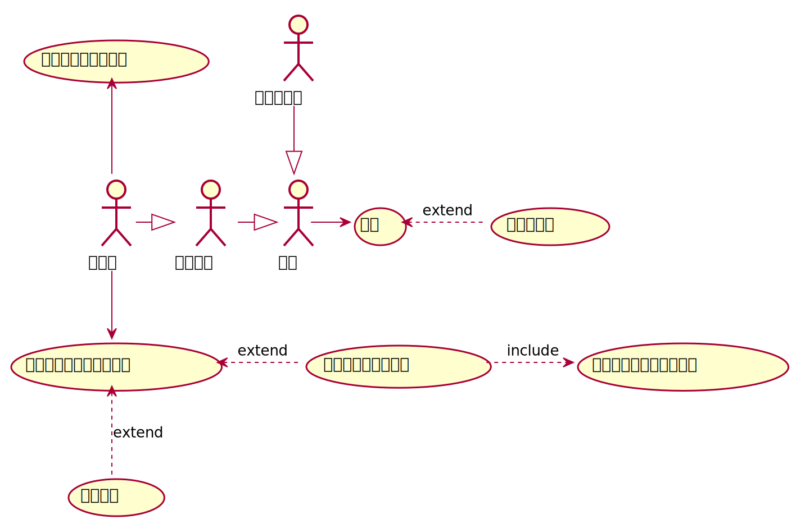

# README



```
API:  
    管理员:  
        发送命令到设备  
        查看识别记录  
        创建新用户  
        关联用户和特征  
    用户:  
        查询进出记录
        查看特征
    消息:  
        接收设备输出  

DB:  
    账号:  
        学工号  
        姓名
        是否管理员  
    人脸特征记录:  
        ID  
        拥有者学工号-外键-可空  
        特征 
    人脸特征关联创建记录:
        ID
        添加者学工号-外键
        添加时间
        人脸特征ID-外键
    识别记录:
        ID
        时间
        匹配特征ID-外键 
        // 首次见未知特征即添加至人脸特征记录

    
```
数据库ER图

